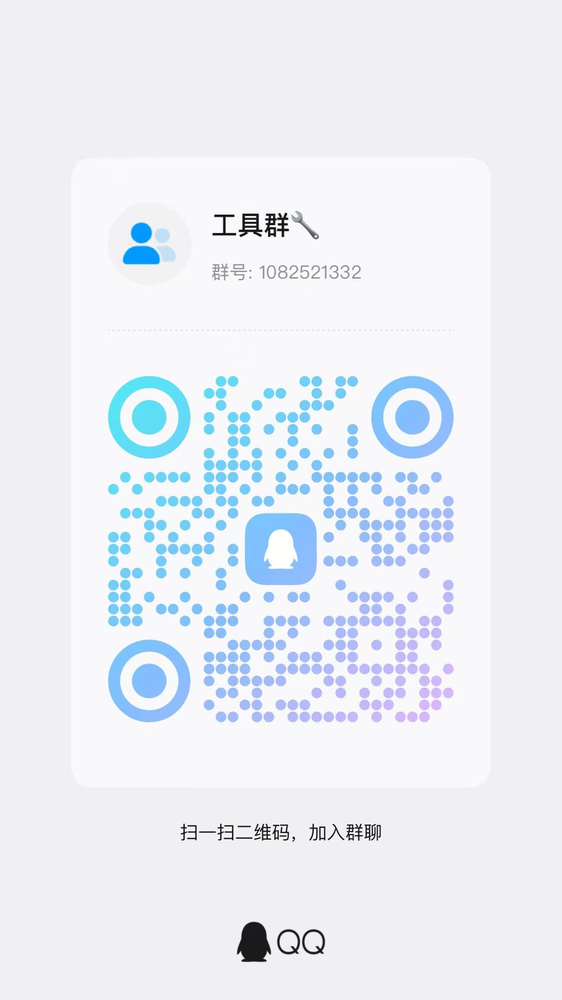

# 大模型降智检测

线上 [www.modeltool.cn](https://www.modeltool.cn) · 仓库 [github.com/fusuzhenxin/modeltool](https://github.com/fusuzhenxin/modeltool)

用你自己的 OpenAI 兼容接口，给 GPT、Claude、DeepSeek、Kimi、通义千问、豆包、Gemini、Grok 做同一套评测。页面把题目交给当前网站的 `/api/chat` 转发，密钥不会写进仓库，也不会出现在导出的报告里。

交流群是 **工具群**，群号 `1082521332`。打开站点后，顶栏 QQ 图标会显示同一张二维码。



## 开始使用

直接打开 [https://www.modeltool.cn](https://www.modeltool.cn)。

本机需要 Python 3，`serve.py` 只用标准库。Windows 双击 `start.bat`，其他系统在项目目录执行 `python serve.py`，然后打开 [http://127.0.0.1:8766/index.html](http://127.0.0.1:8766/index.html)。服务只监听 `127.0.0.1:8766`。不要用文件方式直接打开 HTML，那样请求不会经过转发，浏览器里的记录也和网站地址各存一份。

第一次测试前点顶栏 **接口设置**，填写接口地址和密钥。地址需要以 `http://` 或 `https://` 开头。模型下拉默认选中列表里的第一个 GPT-6。中转站上的模型 ID 和列表不一致时，可以填写「模型 ID 覆盖」。

## 能测什么

| 页面 | 作用 |
| --- | --- |
| 首页 | 综合结果、最近使用、六家官方模型实况 |
| 模型检测页 | 汇总基础、糖果、鹈鹕三项已经完成的分数 |
| 基础测试页 | 能力、逻辑推理、代码、知识问答 |
| 中转站测试 | 检查协议、模型回显、流式、工具调用等有没有被改写 |
| 糖果测试页 | 用改过数字的熟题看幻觉 |
| 鹈鹕骑车测试页 | 让模型写一只骑自行车的鹈鹕，SVG、2D HTML 或 3D |
| HTML 鹈鹕作品 | 公开作品目录，封面是静图，详情页再打开可玩页面 |
| 提示词库 | 浏览评测提示词，含糖果原题和 HTML 作品的生成要求。可复制，也可用自己的接口试跑 |
| 官方状态 | 点首页上的厂商芯片进入，版式跟随各家公开状态页 |

顶栏 GitHub 图标打开本仓库。QQ 图标在当前页弹出群二维码。中转导航打开 [www.veridrop.cn](https://www.veridrop.cn)。

## 分数

基础分是已经完成的能力、逻辑推理、代码、知识问答的平均。糖果和鹈鹕各自取最近一次真实完成的分数。三项都有分数时才计算综合分：

**综合分 = 基础 × 0.4 + 糖果 × 0.35 + 鹈鹕 × 0.25**

缺任何一项时综合分留空，缺的那项也不会计成 0。接口还没配置、题目还没跑完，页面显示未检测。

| 分数 | 检测页 | 鹈鹕页 |
| --- | --- | --- |
| 85 及以上 | 正常 | 未降智 |
| 70 到 84 | 轻微异常 | 轻微降智 |
| 70 以下 | 明显异常 | 明显降智 |

中转站测试单独给出掺水报告，不改写基础能力分。模型下拉、题量和难度刷新后回到默认值。测试记录和接口配置按当前网址保存在这台浏览器里。

## 密钥

密钥在写入 `localStorage` 之前用 AES-GCM 加密。解开用的钥匙放在 IndexedDB，不能被导出。本站没有后台保存密钥。页面在本地解开之后，把当次请求交给 `/api/chat` 或 `/api/probe`，再转到你填写的接口。导出的报告不含密钥。线上这一跳最长会被平台停在 300 秒；本机转发不另设秒数，一直等到上游返回。

换浏览器、无痕窗口，或者在 `127.0.0.1` 和 `localhost` 之间切换，需要重新填写密钥。清除这个站点的数据后，记录和接口配置一起消失。

## 官方状态

首页芯片读取各家公开状态，经当前网站的 `/api/status` 转发，不经过第三方状态站，也不使用你的模型密钥。

- OpenAI 来自 [status.openai.com](https://status.openai.com)，按官方分组、可用率和每日色条展示。
- Claude 来自 [status.claude.com](https://status.claude.com)，Kimi 来自 [status.moonshot.cn](https://status.moonshot.cn)，每日颜色和可用率用官方 uptime 接口。
- Gemini 使用 Google Cloud 公开事件里与 Gemini 有关的条目。
- Grok 使用 [status.x.ai/feed.xml](https://status.x.ai/feed.xml)。
- 官方页没有给出可用率时，页面不显示百分比。某一家暂时连不上时，这一家显示未获取。

每家详情都列出该来源公布的近期事件。

## 作品目录

`works.html` 展示的是公开作品，和你自己测出来的鹈鹕画稿分开。列表用 `assets/work-covers/` 里的静图，避免一页同时跑多个 3D 页面。详情页能嵌入的地址会在线打开，不能嵌入的提供原页链接。

站内文件：

- `works/glm-5.2.html`、`qwen3.6.html`、`kimi-k3.html`、`gpt-5.6-sol.html`、`claude-opus-5.html`、`qwen3.6-2d.html` 来自 Apache-2.0 数据集 [pelican-svg-drawings](https://huggingface.co/datasets/sergiopaniego/pelican-svg-drawings)。
- `works/tihuqiche.html` 是憧憬 Licoy 的《鹈鹕骑车》，MIT，上游仓库 [Licoy/tihuqiche](https://github.com/Licoy/tihuqiche)。

QQ 飞车、穿越火线之运输船等外链是公开的致敬演示页面，不是腾讯的官方游戏。

## 目录

```
start.bat           本机 Windows 启动
serve.py            本机静态站和转发
api/                线上的聊天、探测和官方状态转发
index.html 等       页面
js/                 界面、题库、评分、作品目录、状态展示
css/style.css       样式
assets/             图标、封面、QQ 群二维码
works/              放在本站的 HTML 作品
sitemap.xml         https://www.modeltool.cn 的站点地图
```

模型对话走 `/api/chat`，连接测试走 `/api/probe`，官方状态走 `/api/status`。
